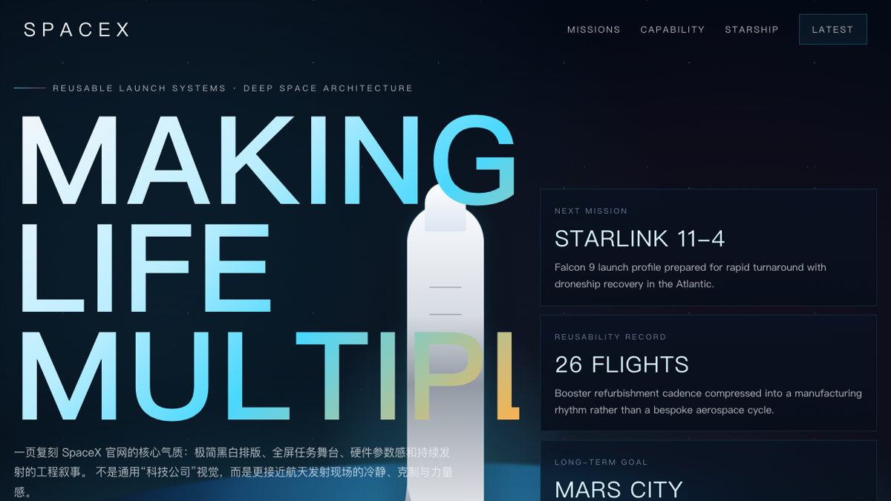
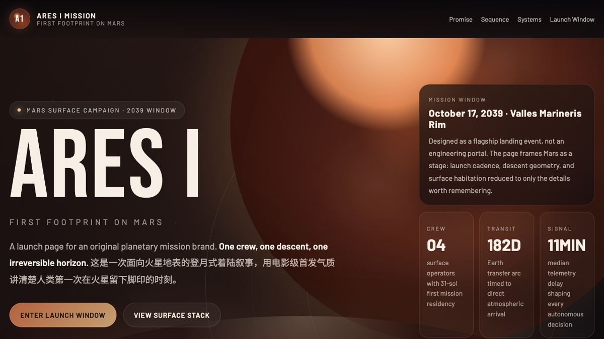
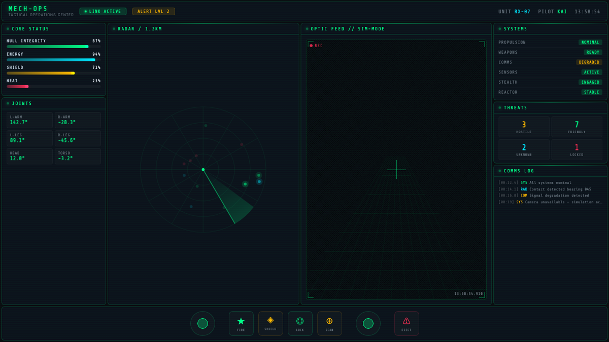
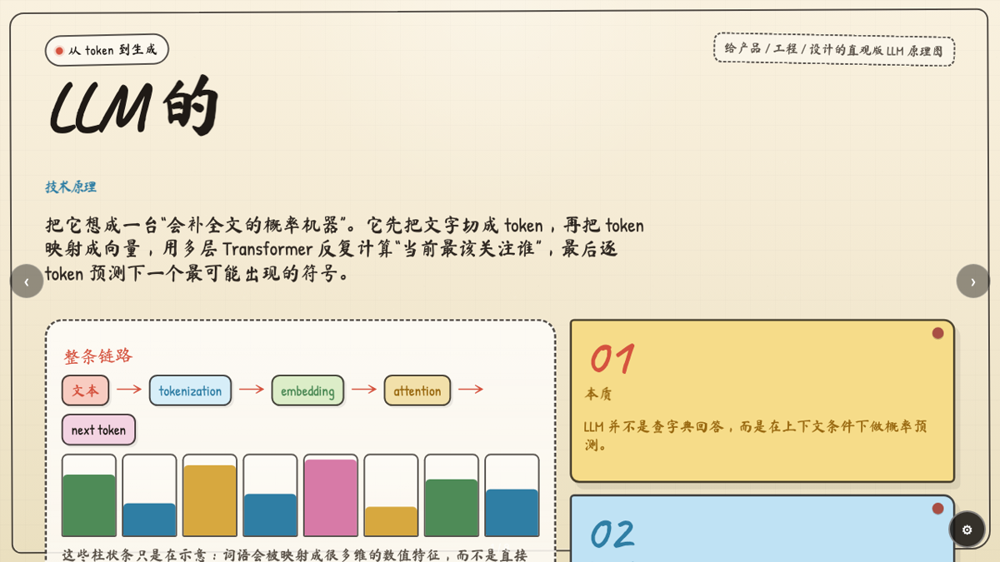
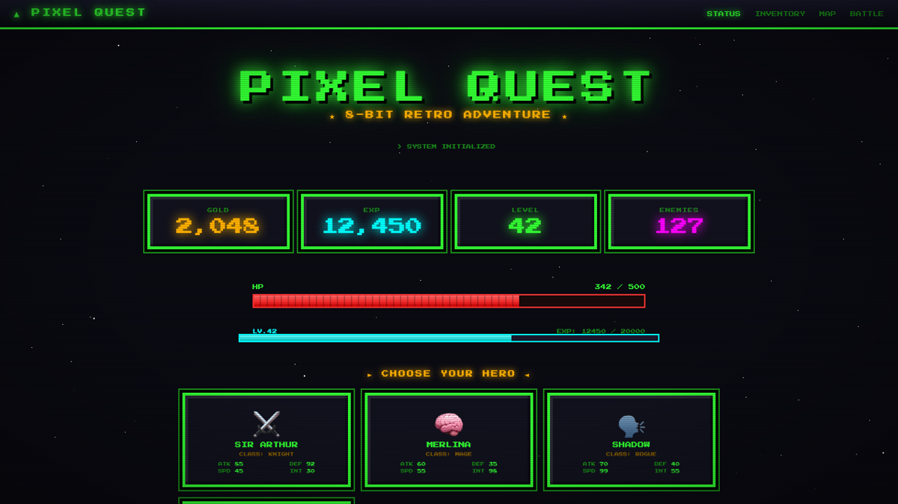

# CC Design

**[Demo](https://cc-design-demo.vercel.app)**

A Claude Code skill for high-fidelity HTML design and prototype creation — slide decks, interactive prototypes, landing pages, UI mockups, animations, and visual design explorations.

Adapted from the Claude Artifacts design environment to work natively in Claude Code, using Playwright MCP for verification and local scripts for export.

## Screenshots

**Demo Gallery**

[](./screenshots/previews/cc-design-home-preview.png)

<p align="center">
  <a href="./screenshots/previews/cc-design-enterprise-preview.png"></a>
  <a href="./screenshots/previews/cc-design-scifi-preview.png"></a>
  <a href="./screenshots/previews/cc-design-tesla-preview.png"></a>
</p>
<p align="center">
  <a href="./screenshots/previews/cc-design-aether-preview.png"></a>
  <a href="./screenshots/previews/cc-design-glass-preview.png"></a>
  <a href="./screenshots/previews/cc-design-banking-preview.png"></a>
</p>
<p align="center">
  <a href="./screenshots/previews/cc-design-spacex-preview.png"></a>
  <a href="./screenshots/previews/cc-design-mars-preview.png"></a>
  <a href="./screenshots/previews/cc-design-mechops-preview.png"></a>
</p>
<p align="center">
  <a href="./screenshots/previews/cc-design-llm-sketch-preview.png"></a>
  <a href="./screenshots/previews/cc-design-retro-preview.png"></a>
  <a href="./screenshots/previews/cc-design-thermo-preview.png"></a>
</p>

## Overview

CC Design embeds a structured design workflow into Claude Code, enabling it to operate as an expert product designer across the full lifecycle: from clarifying requirements and acquiring design context, through building with real UI kits and design systems, to delivering polished HTML artifacts with screenshot-based verification.

Two core principles:

- **Context-first design** — Never design from scratch when existing brand systems, component libraries, or product code is available. Actively acquire and reuse design vocabulary before creating new visual directions.
- **Progressive disclosure** — The main skill definition stays concise while 12+ technical references are loaded on demand, keeping context window usage minimal.

## Features

| Category | Capabilities |
|---|---|
| **Output formats** | Interactive prototypes, slide decks, landing pages, UI mockups, animated motion studies, wireframes, design systems |
| **Brand style cloning** | Progressive loading of 68+ brand design systems from [getdesign.md](https://getdesign.md) (Stripe, Vercel, Notion, Linear, Apple, etc.) |
| **Design patterns** | Curated catalog of proven layout patterns with case studies from Stripe, Linear, Notion, and more |
| **Design excellence** | Built-in quality framework with emotional tone targeting, hierarchy checks, and anti-slop rules |
| **Variations** | Generates 3+ design directions across layout, interaction, visual intensity, and motion axes |
| **Prototyping** | React + Babel inline JSX with pinned versions, component scope management, starter scaffolds |
| **Tweaks system** | Self-contained in-page design controls with real-time preview and localStorage persistence |
| **Verification** | Three-phase verification (structural, visual, design excellence) via Playwright MCP |
| **Export** | PPTX, PDF, and self-contained inline HTML via local Node.js scripts |

## Installation

Clone into your Claude Code skills directory:

```bash
git clone https://github.com/ZeroZ-lab/cc-design.git ~/.claude/skills/cc-design
```

Or add as a submodule:

```bash
git submodule add https://github.com/ZeroZ-lab/cc-design.git skills/cc-design
```

### Export scripts

```bash
cd ~/.claude/skills/cc-design/scripts && npm install && cd -
```

This installs `pptxgenjs` and `playwright`. For Playwright-backed export:

```bash
npx playwright install chromium
```

## Project Structure

```
cc-design/
├── SKILL.md                              # Skill definition (YAML frontmatter + workflow)
├── EXAMPLES.md                           # Usage examples and advanced workflows
├── screenshots/                          # Demo screenshots for README
├── agents/
│   └── openai.yaml                       # Codex-compatible platform interface config
├── references/
│   ├── design-excellence.md              # Quality framework, emotional tones, anti-slop rules
│   ├── design-patterns.md                # Proven layout patterns and component patterns
│   ├── frontend-design.md                # General frontend design fundamentals
│   ├── design-system-creation.md         # Creating design systems from scratch
│   ├── getdesign-loader.md               # Brand style loading from getdesign.md
│   ├── react-babel-setup.md              # React/Babel pinned versions and scope rules
│   ├── starter-components.md             # Starter component catalog and usage
│   ├── interactive-prototype.md          # Interactive prototype patterns
│   ├── tweaks-system.md                  # In-page tweak controls
│   ├── platform-tools.md                 # Playwright tool reference
│   ├── verification-protocol.md          # Three-phase verification protocol
│   ├── question-protocol.md              # Structured clarifying question templates
│   └── case-studies/                     # Real-world design references
│       ├── README.md                     # Case study index
│       ├── product-pages/                # Stripe, Linear, Notion landing pages
│       ├── presentations/                # Pitch deck, keynote-style layouts
│       ├── mobile-apps/                  # iOS onboarding patterns
│       └── creative-works/               # Creative design references
├── templates/                            # Starter component files
│   ├── deck_stage.js                     # Slide presentation stage
│   ├── design_canvas.jsx                 # Side-by-side option grid
│   ├── ios_frame.jsx                     # iPhone device frame
│   ├── android_frame.jsx                 # Android device frame
│   ├── macos_window.jsx                  # macOS window chrome
│   ├── browser_window.jsx                # Browser window chrome
│   └── animations.jsx                    # Timeline animation engine
└── scripts/                              # Export utility scripts
    ├── package.json
    ├── gen_pptx.js                       # HTML → PPTX export
    ├── super_inline_html.js              # HTML + assets → single file
    ├── open_for_print.js                 # HTML → PDF via Playwright
    └── lib/
        └── parse_args.js                 # Shared CLI argument parser
```

### Architecture

```
┌─────────────────────────────────────┐
│           SKILL.md                  │  ← Always loaded into context
│  Routing table, workflow, rules,    │
│  content guidelines, contracts      │
└──────────────┬──────────────────────┘
               │  Loaded on demand per routing table
       ┌───────┴────────┐
       ▼                ▼
┌──────────────┐  ┌──────────────┐
│ references/  │  │ templates/   │
│ 12 docs +    │  │ (copied to   │
│ case-studies │  │  project)    │
└──────────────┘  └──────────────┘
                        │
                ┌───────┴────────┐
                ▼                ▼
         ┌──────────────┐  ┌──────────────┐
         │  scripts/    │  │  agents/     │
         │  (export     │  │  (platform   │
         │   tools)     │  │   config)    │
         └──────────────┘  └──────────────┘
```

## Usage

The skill activates automatically for design-related requests. Example prompts:

```
"Design a landing page for our SaaS product"
"Create a 10-slide pitch deck for the Q3 board meeting"
"Build an interactive prototype of the checkout flow"
"Explore 3 visual directions for the new dashboard"
"Make the onboarding screens look good on mobile"
"Create a design system for our product"
"Low-fidelity wireframe for an e-commerce checkout"
```

### Brand Style Cloning

Mention a brand name to load its design system from [getdesign.md](https://getdesign.md):

```
"Create a pricing page with Stripe's aesthetic"
"Notion-style kanban board"
"Mix Vercel's minimalism with Linear's purple accents"
"Show me this dashboard in Apple style vs Tesla style"
```

Supports 68+ brands. See [EXAMPLES.md](./EXAMPLES.md) for detailed patterns.

## Design Workflow

```
Understand → Route → Acquire Context → Design Intent → Build → Verify → Deliver
    │          │           │                │             │        │         │
    ▼          ▼           ▼                ▼             ▼        ▼         ▼
 Clarify    Load        Read            6-question    HTML +   3-phase    File
 questions  refs +      design          checklist     React    verify:    delivered
            templates   system          (focal,      comps    structural,
                                     tone, flow,             visual,
                                     spacing,               excellence
                                     color, type)
```

The routing table in SKILL.md maps task types to the specific references and templates needed, loading only what's required for each design task.

## Compatibility

| Platform | Status | Notes |
|---|---|---|
| Claude Code (CLI) | **Primary target** | Playwright MCP + local scripts |
| Codex / OpenAI-compatible | Supported | Prompt metadata in `agents/openai.yaml` |

## Contributing

1. Fork this repository
2. Create a feature branch (`git checkout -b feat/your-feature`)
3. Keep SKILL.md under 200 lines — move new technical content to `references/`
4. Add case studies under `references/case-studies/` with subcategory folders
5. Test with representative design prompts
6. Open a pull request

When adding new reference documents, add a row to the routing table in SKILL.md so the model knows when to load it.

## License

MIT
