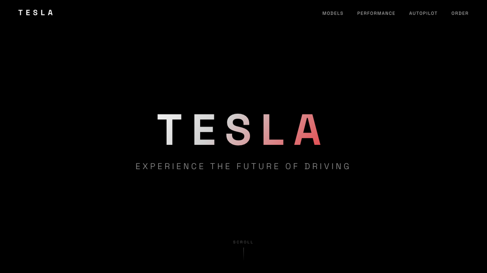
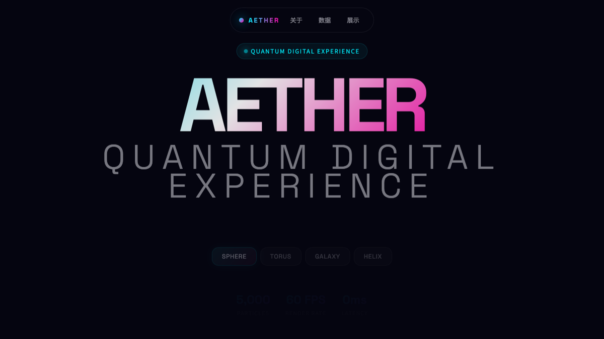

# cc-design

**[Demo](https://cc-design-demo.vercel.app)**

A Claude Code skill for high-fidelity HTML design and prototype creation — slide decks, interactive prototypes, landing pages, UI mockups, animations, visual design explorations, and complete design systems. Supports the full design lifecycle: context gathering, structured design thinking, execution, review, and multi-format export.

## Screenshots

**Demo Gallery**

[](./screenshots/previews/cc-design-home-preview.png)

<p align="center">
  <a href="./screenshots/previews/cc-design-enterprise-preview.png"></a>
  <a href="./screenshots/previews/cc-design-scifi-preview.png"></a>
  <a href="./screenshots/previews/cc-design-tesla-preview.png"></a>
</p>
<p align="center">
  <a href="./screenshots/previews/cc-design-aether-preview.png"></a>
  <a href="./screenshots/previews/cc-design-glass-preview.png"></a>
  <a href="./screenshots/previews/cc-design-banking-preview.png"></a>
</p>

## Overview

cc-design embeds a structured design workflow into Claude Code, enabling it to operate as an expert product designer. Five core principles guide every task:

- **Fact verification (P0)** — Never guess. Verify claims about design trends, brand aesthetics, or technology. Wrong facts are worse than no facts.
- **Gather enough context first (P1)** — Resolve or explicitly assume the blocking fields before any full build: audience, output shape, scope, hard constraints, reference source, and success criteria.
- **Visible plan before build (P1.5)** — Once blocking uncertainty is resolved, produce a short execution plan and wait for approval before starting the full build.
- **Anti-AI slop (P2)** — Aggressive gradients, emoji (unless brand), generic SaaS hero sections, and overused fonts are banned. Full rules in `references/content-guidelines.md`.
- **Audible loading (P3)** — Runtime bundles are never loaded silently. cc-design announces every reference/template bundle with `Load: because=... loaded=...` before using it.

Progressive disclosure keeps the main skill definition concise while 60+ reference docs load on demand.
`load-manifest.json` is the machine-readable source of truth for bundle contents, `scripts/generate-bundle-catalog.mjs` generates the bundle catalog for AI matching, and `scripts/lint-load-manifest.mjs` checks that every reference/template is accounted for. Routing prefers a semantic-matching subagent when the platform provides one, and falls back to `scripts/resolve-load-bundles.mjs` when it does not.

Runtime bundles are organized into three groups:
- **Base-required bundles (`基础必载`)** — always loaded for every design task, including typography, layout patterns, and visual/color theory
- **Conditionally required bundles (`条件命中后必载`)** — loaded when a task type or checkpoint is triggered
- **Truly optional inspirations (`真正可选`)** — case studies and reference material only

The core product promise is behavioral, not just feature breadth:
- every design task starts with the base-required bundle
- new ambiguous tasks start with structured step-by-step confirmation
- new tasks use a short route-shaping question batch before loading additional task bundles
- richly specified briefs can skip most clarification, but still require a visible plan before build
- explicit speed requests compress clarification, but still produce a mini-plan unless the user explicitly says to skip planning
- first-pass work stops for approval after the plan
- small edits and follow-up iterations do not reopen the full discovery flow
- existing `DESIGN.md` files are never silently rewritten; the user confirms append / merge / overwrite first

## Features

| Category | Capabilities |
|---|---|
| **Output formats** | Interactive prototypes, slide decks, landing pages, UI mockups, animated motion studies, wireframes, design systems |
| **Design thinking** | 8-layer design framework (Goal→Information→Structure→Interaction→Visual→Brand→System→Validation), 10 core design principles, theory foundations for each layer. See `references/design-thinking-framework.md` |
| **Design philosophies** | 20 design philosophy schools organized in 5 schools: Information Architects, Motion Poets, Minimalists, Experimental Vanguard, Eastern Philosophy. See `references/design-styles.md` |
| **Design theory library** | In-depth theory references: typography design system, color theory, information design, interaction design, visual design, brand & emotion theory, system design theory, responsive design, layout systems |
| **Brand style cloning** | Progressive loading of 68+ brand design systems from [getdesign.md](https://getdesign.md) |
| **Design patterns** | Curated catalog of proven layout patterns with case studies, plus documented anti-patterns for layout, typography, color, and interaction |
| **Design review** | 5-dimension scoring framework (Philosophy Alignment, Visual Hierarchy, Craft Quality, Functionality, Originality). See `references/critique-guide.md` |
| **Junior Designer Mode** | Structured step-by-step guidance for less experienced designers: context gathering, asset acquisition, structured delivery workflow |
| **Anti-AI slop** | Comprehensive anti-slop rules: banned visual patterns, font blacklist, color strategy, layout rules. See `references/content-guidelines.md` |
| **Design guardrails** | Iron Law contract, Red Flags checklist, Common Sayings traps, Failure Mode Handling, Exit Conditions. See `references/` guardrail collection |
| **Design ADR** | Architecture Decision Records for design — document design rationale, trade-offs, and decisions made |
| **Animation** | Stage+Sprite timeline engine with easing library, `__ready`/`__recording` signal protocol, 16 hard pitfall rules, best practices guide |
| **Variations** | Generates 3+ design directions across layout, interaction, visual intensity, and motion axes |
| **Prototyping** | React + Babel inline JSX with pinned versions, scope management, starter scaffolds |
| **Tweaks system** | In-page design controls with localStorage persistence and EDITMODE forward-compatibility |
| **UX & research** | Form design guide, UX writing patterns, usability testing framework, data visualization guide, user research methods, design handoff templates |
| **Case studies** | Real-world design case studies: SaaS product pages (Stripe, Linear, Notion), presentations (pitch deck, keynote), mobile apps (iOS onboarding) |
| **Verification** | Three-phase verification (structural, visual, design excellence) via Playwright MCP, plus verification protocol |
| **Export** | PDF (multi-file + single-file), PPTX (image mode + editable mode under constraints), video (HTML to MP4 via Playwright + ffmpeg), inline HTML |
| **Audio design** | Dual-track audio system (SFX beat layer + BGM atmosphere layer), 37 SFX catalog, ffmpeg mixing templates |

## Installation

Source: [ZeroZ-lab/cc-design](https://github.com/ZeroZ-lab/cc-design)

```bash
# Install via skills CLI
npx skills add ZeroZ-lab/cc-design

# Update to the latest version
npx skills update
```

## Version Awareness

`cc-design` ships with a root `VERSION` file and a lightweight update checker:

```bash
~/.codex/skills/cc-design/bin/ccdesign-update-check
```

When the skill detects that your local version is stale, it will surface:

```text
UPGRADE_AVAILABLE <local> <remote>
```

`cc-design` only detects and prompts. It does not own the upgrade executor.

### Export scripts

```bash
cd ~/.claude/skills/cc-design/scripts && npm install && cd -
```

This installs `playwright`, `pptxgenjs`, `pdf-lib`. For Playwright-backed export:

```bash
npx playwright install chromium
```

For video and audio export, install ffmpeg (optional dependency):

```bash
# macOS
brew install ffmpeg

# Ubuntu/Debian
sudo apt install ffmpeg

# Windows (via Chocolatey)
choco install ffmpeg
```

For editable PPTX mode (optional):

```bash
# sharp is an optionalDependency — npm install will attempt it
# If it fails on your platform, editable PPTX falls back to image mode
```

Audio assets (SFX and BGM) are committed to the repository (~10-14 MB total). See `references/sfx-library.md` and `references/audio-design-rules.md` for the catalog and usage.

## Project Structure

```
cc-design/
├── load-manifest.json                    # Runtime bundle map for refs/templates/checkpoints
├── SKILL.md                              # Skill definition (YAML + routing table + workflow)
├── EXAMPLES.md                           # Usage examples and advanced workflows
├── test-prompts.json                     # 8 test prompts for skill validation
├── screenshots/                          # Demo screenshots for README
├── agents/
│   └── openai.yaml                       # Codex-compatible platform interface config
├── references/
│   │
│   │  # Core workflow & process
│   ├── workflow.md                       # Full design workflow (step-by-step confirmation)
│   ├── design-context.md                 # Context gathering workflow
│   ├── design-excellence.md              # Quality framework, emotional tones
│   ├── junior-designer-mode.md           # Structured guidance for less experienced designers
│   ├── asset-acquisition.md              # Asset acquisition guidelines
│   │
│   │  # Design thinking & philosophy
│   ├── design-thinking-framework.md      # 8-layer design thinking framework
│   ├── design-philosophy.md              # Design philosophy foundations
│   ├── design-principles.md              # 10 core design principles
│   ├── design-styles.md                  # 20 design philosophy schools (5 schools)
│   ├── design-patterns.md                # Proven layout patterns with case studies
│   ├── design-system-creation.md         # Creating design systems from scratch
│   ├── anti-patterns/                    # Documented anti-patterns
│   │   ├── layout.md
│   │   ├── typography.md
│   │   ├── color.md
│   │   └── interaction.md
│   │
│   │  # Design theory
│   ├── typography-design-system.md       # Complete typography design system
│   ├── color-theory.md                   # Color theory foundations
│   ├── information-design-theory.md      # Information design principles
│   ├── interaction-design-theory.md      # Interaction design theory
│   ├── visual-design-theory.md           # Visual design theory
│   ├── brand-emotion-theory.md           # Brand and emotion theory
│   ├── system-design-theory.md           # System-level design theory
│   ├── layout-systems.md                 # Layout systems guide
│   ├── responsive-design.md              # Responsive design guide
│   │
│   │  # Guardrails (behavioral contracts)
│   ├── design-iron-law.md                # Iron Law: non-negotiable design contract
│   ├── design-red-flags.md               # Red flags: stop signals during design
│   ├── design-common-sayings.md          # Common sayings: anti-pattern traps
│   ├── failure-mode-handling.md          # Failure mode recovery procedures
│   ├── exit-conditions.md                # Exit conditions for each workflow stage
│   ├── design-adr.md                     # Architecture Decision Records for design
│   │
│   │  # Content & anti-slop
│   ├── content-guidelines.md             # Anti-AI slop rules, font/color/layout bans
│   ├── ux-writing.md                     # UX writing patterns
│   │
│   │  # UX & research
│   ├── form-design.md                    # Form design principles
│   ├── usability-testing.md              # Usability testing framework
│   ├── user-research-methods.md          # User research methods
│   ├── data-visualization.md             # Data visualization guide
│   ├── design-handoff.md                 # Design handoff templates
│   │
│   │  # Brand & frontend
│   ├── getdesign-loader.md               # Brand style loading from getdesign.md
│   ├── frontend-design.md                # General frontend design fundamentals
│   ├── react-setup.md                    # React/Babel pinned versions and scope rules
│   ├── starter-components.md             # Starter component catalog
│   ├── interactive-prototype.md          # Interactive prototype patterns
│   ├── tweaks-system.md                  # In-page tweak controls (useTweaks hook)
│   │
│   │  # Animation
│   ├── animations.md                     # Stage+Sprite API reference
│   ├── animation-best-practices.md       # Animation design principles and recipes
│   ├── animation-pitfalls.md             # 16 hard rules from real failure cases
│   │
│   │  # Slide decks & structure
│   ├── slide-decks.md                    # Comprehensive slide deck guide
│   ├── scene-templates.md                # 8 output-type scene specs
│   │
│   │  # Export & verification
│   ├── verification.md                   # HTML output verification guide
│   ├── verification-protocol.md          # Three-phase verification protocol
│   ├── editable-pptx.md                  # PPTX export constraints (4 hard rules)
│   ├── video-export.md                   # Video export pipeline docs
│   ├── audio-design-rules.md             # Dual-track audio system specs
│   ├── sfx-library.md                    # 37 SFX catalog and selection guide
│   ├── platform-tools.md                 # Playwright tool reference
│   ├── critique-guide.md                 # 5-dimension design review scoring
│   ├── principle-review.md               # Design principle review checklist
│   ├── design-checklist.md               # Master design checklist
│   │
│   │  # Case studies
│   ├── case-studies/                     # Real-world design references
│   │   ├── README.md                     # Case study index
│   │   ├── product-pages/
│   │   │   ├── stripe-homepage.md
│   │   │   ├── linear-features.md
│   │   │   └── notion-landing.md
│   │   ├── presentations/
│   │   │   ├── pitch-deck-example.md
│   │   │   └── keynote-style.md
│   │   ├── mobile-apps/
│   │   │   └── ios-onboarding.md
│   │   └── creative-works/               # (placeholder)
├── assets/
│   └── personal-asset-index.example.json # Personal asset index template
├── templates/                            # Starter component files
│   ├── deck_stage.js                     # Slide presentation stage (Shadow DOM)
│   ├── design_canvas.jsx                 # Side-by-side option grid with lightbox
│   ├── ios_frame.jsx                     # iPhone device frame (Dynamic Island)
│   ├── android_frame.jsx                 # Android device frame (punch-hole)
│   ├── macos_window.jsx                  # macOS window chrome (darkMode)
│   ├── browser_window.jsx                # Browser window chrome
│   └── animations.jsx                    # Timeline animation engine (signals)
└── scripts/                              # Utility scripts
    ├── package.json                      # Dependencies and npm scripts
    │
    │   # Lint & validation
    ├── lint-load-manifest.mjs           # Checks refs/templates are all routed or tagged
    ├── resolve-load-bundles.mjs         # Runtime resolver for manifest-backed bundle selection
    ├── generate-bundle-catalog.mjs      # Generates compact bundle catalog for AI matching
    ├── check-behavior-contract.sh       # Verifies behavior-contract changes require VERSION bump
    │
    │   # Export
    ├── export_deck_pdf.mjs              # Multi-file deck → PDF
    ├── export_deck_stage_pdf.mjs        # Single-file deck → PDF
    ├── export_deck_pptx.mjs             # Dual-mode PPTX export
    ├── html2pptx.js                     # HTML to PPTX conversion engine
    ├── render-video.js                  # HTML → MP4 (Playwright + ffmpeg)
    ├── super_inline_html.js             # HTML + assets → single file
    │
    │   # Audio & format conversion
    ├── add-music.sh                     # BGM mixing (ffmpeg)
    ├── convert-formats.sh               # MP4 → 60fps + GIF conversion
    │
    └── lib/
        └── parse_args.js                # Shared CLI argument parser
```

### Architecture

```
┌─────────────────────────────────────┐
│           SKILL.md                  │
│  Triggering, workflow, contracts    │
└──────────────┬──────────────────────┘
               │  Reads machine-readable routing rules
               ▼
┌─────────────────────────────────────┐
│       load-manifest.json            │
│  task bundles + checkpoints +       │
│  optional inspirations              │
└──────────────┬──────────────────────┘
               │  Announces each bundle before loading
       ┌───────┴────────┐
       ▼                ▼
┌──────────────┐  ┌──────────────┐
│ references/  │  │ templates/   │
│ loaded on    │  │ copied into  │
│ demand       │  │ the project  │
└──────────────┘  └──────────────┘
                        │
                ┌───────┴────────┐
                ▼                ▼
         ┌──────────────────┐  ┌──────────────┐
         │  scripts/        │  │  agents/     │
         │  lint + validate │  │  platform    │
         │  bundle catalog  │  │  metadata    │
         │  behavior check  │  │              │
         │  export          │  │              │
         └──────────────────┘  └──────────────┘
```

## Usage

The skill activates automatically for design-related requests. Example prompts:

```
"Design a landing page for our SaaS product"
"Create a 10-slide pitch deck for the Q3 board meeting"
"Build an interactive prototype of the checkout flow"
"Explore 3 visual directions for the new dashboard"
"Animate this logo reveal with the Takram style"
"Export the deck as editable PPTX"
"Record the animation as a 25fps MP4 video"
"Review this design and score it on 5 dimensions"
```

### Design Style Selection

Mention a style philosophy to set the design direction:

```
"Use the Pentagram style for this infographic"
"Apply Experimental Jetset minimalism to this poster"
"Mix Takram restraint with Locomotive motion for the hero"
```

See `references/design-styles.md` for all 20 philosophy schools.

### Brand Style Cloning

Mention a brand name to load its design system from [getdesign.md](https://getdesign.md):

```
"Create a pricing page with Stripe's aesthetic"
"Notion-style kanban board"
"Mix Vercel's minimalism with Linear's purple accents"
```

## Design Workflow

```
Understand → Route → Acquire Context → Plan → Approval → Build → Verify → Deliver
    │          │           │                │        │           │        │         │
    ▼          ▼           ▼                ▼        ▼           ▼        ▼         ▼
 Stepwise   Base bundle + Read          Visible   Manager     HTML +   3-phase    File
 confirm    route-shaping design        plan      signoff     React    verify:    delivered
            questions +  system         with      before      comps    structural,
            semantic     context        facts +   full build           visual,
            supplement                  assumptions                      excellence
```

First-turn behavior follows one default path:
- **New ambiguous task** — load the base-required bundle, ask route-shaping questions step by step, then select conditionally required bundles
- **New rich brief** — skip most clarification, then produce a visible plan before build
- **Explicit speed request** — compress clarification, then produce a mini-plan before build unless the user explicitly says to skip planning
- **Follow-up iteration or minor fix** — act directly unless audience, scope, or output type changes

Bundle selection follows a two-stage route:
- load the base-required bundle first
- if the task is new or underspecified, ask the route-shaping questions that change bundle choice
- map answers to conditionally required task bundles and checkpoints
- use semantic matching only to supplement unresolved task types or optional inspirations

The core behavioral contract is:
- gather enough context before building
- present a visible execution plan
- wait for approval on the first pass
- only then start the full build

`SKILL.md` is the runtime behavior contract. `references/workflow.md` supports execution and must not override it.
`load-manifest.json` is the runtime routing manifest, and `scripts/generate-bundle-catalog.mjs` generates the compact catalog consumed by the AI matcher. Route selection now uses a two-stage model: base-required bundles first, route-shaping questions second, semantic supplement last. If the subagent path is unavailable, fallback routing still goes through `scripts/resolve-load-bundles.mjs`. Every runtime bundle load should be announced before it is read or copied.

Two mandatory checkpoints in the Build phase:
- **Before animation** — load animation-best-practices + animation-pitfalls, verify 16 hard rules
- **Before export** — load the relevant export reference, check tool availability and constraints

Verification is a required maker self-check:
- after the final edit, open/render the artifact yourself
- inspect full page plus every changed section, not just the first screen
- for responsive work, inspect at least desktop + one narrow/mobile viewport

## Compatibility

| Platform | Status | Notes |
|---|---|---|
| Claude Code (CLI) | **Primary target** | Playwright MCP + local scripts + context gathering, visible planning, and approval before build |
| Codex / OpenAI-compatible | Supported | Prompt metadata in `agents/openai.yaml`, optimized for context gathering, visible planning, and approval before build |

## Contributing

1. Fork this repository
2. Create a feature branch (`git checkout -b feat/your-feature`)
3. Keep SKILL.md under 200 lines — move new technical content to `references/`
4. Add case studies under `references/case-studies/` with subcategory folders
5. Test with representative design prompts
6. Open a pull request

When adding new reference documents, add a row to the routing table in SKILL.md so the model knows when to load it.
Also update `load-manifest.json`, keep `scripts/resolve-load-bundles.mjs` behavior aligned, and run `node scripts/lint-load-manifest.mjs`.
Regenerate the bundle catalog after manifest changes: `node scripts/generate-bundle-catalog.mjs`.

If a pull request changes first-turn behavior, it must also update:
- `SKILL.md`
- `README.md`
- `references/workflow.md`
- `CLAUDE.md` if the release checklist changes
- `VERSION`

Run the behavior contract check before merging to enforce this:
```bash
./scripts/check-behavior-contract.sh <base-ref>
```

## License

MIT
